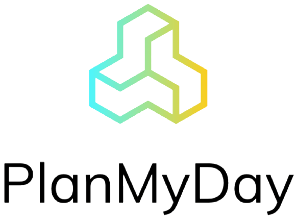
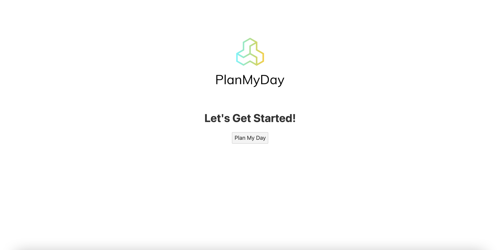
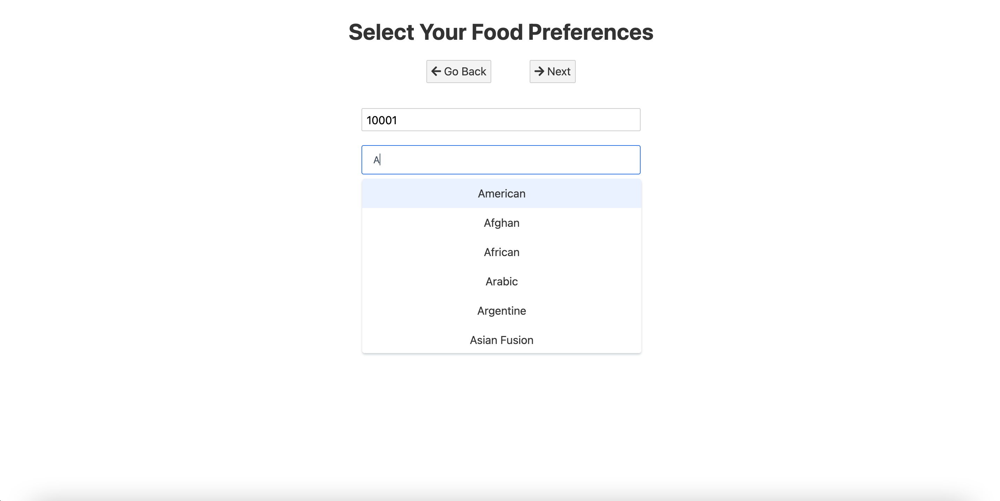
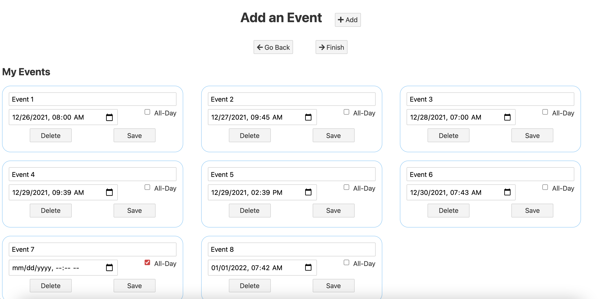
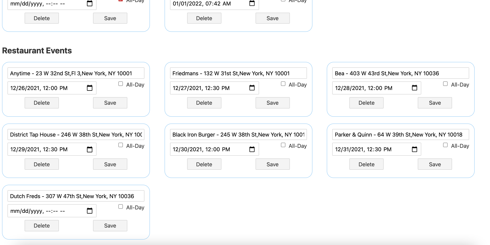
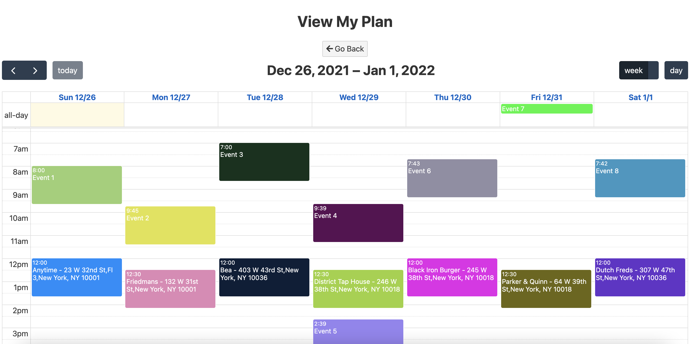

<div id="top"></div>
<br />
<div align="center">
  <a href="https://github.com/vineet2420/pair-finder">
    
  </a>

  <h3 align="center">Fast Agenda Maker</h3>
  <p align="center">
    A responsive calendar for spontaneous individuals who also <br />have a structured approach to their daily agendas.
    </p>
</div>


## Key Features
* Seven unique restaurants generated for each day of the week automatically placed on the calendar
* Input any form of location to get food choices (zip code, city, state, latitude and longitude or any legible address)
* Search and select from 40 different food categories 
* Seperate "Add an Event" interface from calendar viewer to add, update, and delete events
	* Restaurant events load asynchronously from Yelp HTTPS request
* Final planner displays a calendar with all personal and restaurant events merged together
	* Ability to drag and drop events to adjust event times while persisting data through each page

<p align="right">(<a href="#top">back to top</a>)</p>

### Built With

* [Svelte - Web framework](https://svelte.dev/)
	* [JavaScript - Language used within Svelte](https://developer.mozilla.org/en-US/docs/Web/JavaScript)
* [Yelp Fusion API - For fetching restaurants](https://fusion.yelp.com/)
* [Heroku - PaaS for Hosting CORS Redirect](https://www.heroku.com)

<details open>
<summary>Hide Images</summary>

 

  
 
 
</details>

<p align="right">(<a href="#top">back to top</a>)</p>


## Getting Started

Run this project within your own environment.

### Prerequisites

* [Install Node.js (includes npm) - https://nodejs.org/en/download/](https://nodejs.org/en/download/)

### Installation

1. Clone the repo
   ```
   git clone https://github.com/vineet2420/PlanMyDay.git
   ```
   
   or w/ ssh
   ```
   git clone git@github.com:vineet2420/PlanMyDay.git
   ```
2. Change directories 
   ```
   cd PlanMyDay/main/
   ```
3. Run the application locally
	```
	npm run dev
	```
4. Open the full address and port in a web browser, most likely:
	```
	http://localhost:5000/
	```

<p align="right">(<a href="#top">back to top</a>)</p>

### Configuration

##### Add API Key

1. Go to [https://www.yelp.com/developers/documentation/v3/get_started](https://www.yelp.com/developers/documentation/v3/get_started) 
and create an app with the Yelp Fusion API.

2. Paste the API key in the header of `makeRequest()` located in:
	```
	PlanMyDay/main/src/foodSelectionManager.js
	```
	(line 13)
	
	_Note: this is not the best practice for production applications but is suitable for our development environment_

<p align="right">(<a href="#top">back to top</a>)</p>